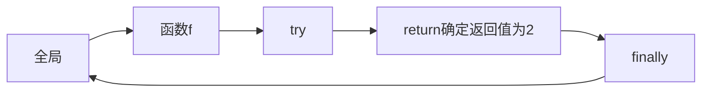

# 【Python杂谈】在try...except...finally中return


你应该对`try...except...finally`的用法熟悉：

```python
try:
    pass
except:
    pass
finally:
    pass
```

不论`try`语句块中发生了什么异常，`finally`语句块中的代码都会被执行。所以我们通常在`finally`语句块中做清理工作，例如关闭文件等等。

请看下面的代码，输出是什么呢？

```python
def f():
  try:
    return 1
  finally:
    print("hehe")

print(f())
```

`finally`块中的代码必定执行，所以输出如下：

```text
hehe
1
```

也就是说，虽然`try`中有`return`语句，但是退出`try...finally`块之前，也一定会执行`finally`块中的语句。

接着，你可能会尝试这样做：

```python
def f():
  try:
    return 1
  finally:
    print("hehe")
    return 2

print(f())
```

输出：

```text
hehe
2
```

可以看出，虽然`try`中返回的是1，但是因为返回之前执行了`finally`块中的语句，所以返回值被更新成了2。过程如下：


下面来尝试一个更加奇怪的：

```python
def f():
  i = 1
  try:
    i = 2
    return i
  finally:
    i = 12
    print("value of i: %d" % i)
    
print(f())
```

输出：

```text
value of i: 12
2
```

因为输出了“value of i: 12”，那么`finally`块肯定是被执行了的。而且`i`的值在`finally`块中也被修改为了12。但是函数`f`的返回值为仍然为`try`块中返回的2。

原因是在执行`return`语句时，Python会将当前的返回值放到函数调用栈顶，在函数返回后弹出。所以，虽然`finally`中修改了i的值，但是并没有修改函数调用栈顶部的返回值，除非再在`finally`块中执行一个`return`语句来覆盖栈顶的返回值。过程如下：



原来是这样。那你可能又会尝试下面的代码：

```python
def f():
  i = 1
  try:
    i = 2
    return i
    return i + 1 # 这里会执行吗？
  finally:
    i = 12
    print("value of i: %d" % i)

print(f())
```

你在`return i`下面加了一行`return i + 1`，想试着更改返回值？不要被`finally`搞糊涂了，`return`就是`return`，只要执行了`return`，那就标志结束当前函数，将控制权交给调用者，而后面的代码是一定不会执行了。但是`finally`又是如此特殊，它允许我们在退出`try...finally...`块之前执行额外的代码，上面代码的执行过程如下：


另外，我们把except加上会是什么样的呢：

```python
def f():
  try:
    return 1
    raise ValueError() # 不会执行
  except ValueError:
    return 2
  finally:
    print("hehe")

print(f())
```

上面的`raise`根本不会执行，所以输出你应该能猜得到：

```text
hehe
1
```

把`raise`放到`return 1`前面：

```python
def f():
  try:
    raise ValueError()
    return 1
  except ValueError:
    return 2
  finally:
    print("hehe")

print(f())
```

输出：

```text
hehe
2
```

因为抛出了异常，所以`return 1`也不会执行了，直接进入`except`块中。因为`finally`必定执行，所以下面代码的输出，不用说你也知道：

```python
def f():
  try:
    raise ValueError()
    return 1
  except ValueError:
    return 2
  finally:
    print("hehe")
    return 3

print(f())
```

## 总结

两点：

* try和except中return语句设定的返回值，可以在finally块中被修改；
* 实践中不要在finally中使用return，这是一种不好的代码，容易让人产生疑惑。finally块主要用于进行清理工作。

