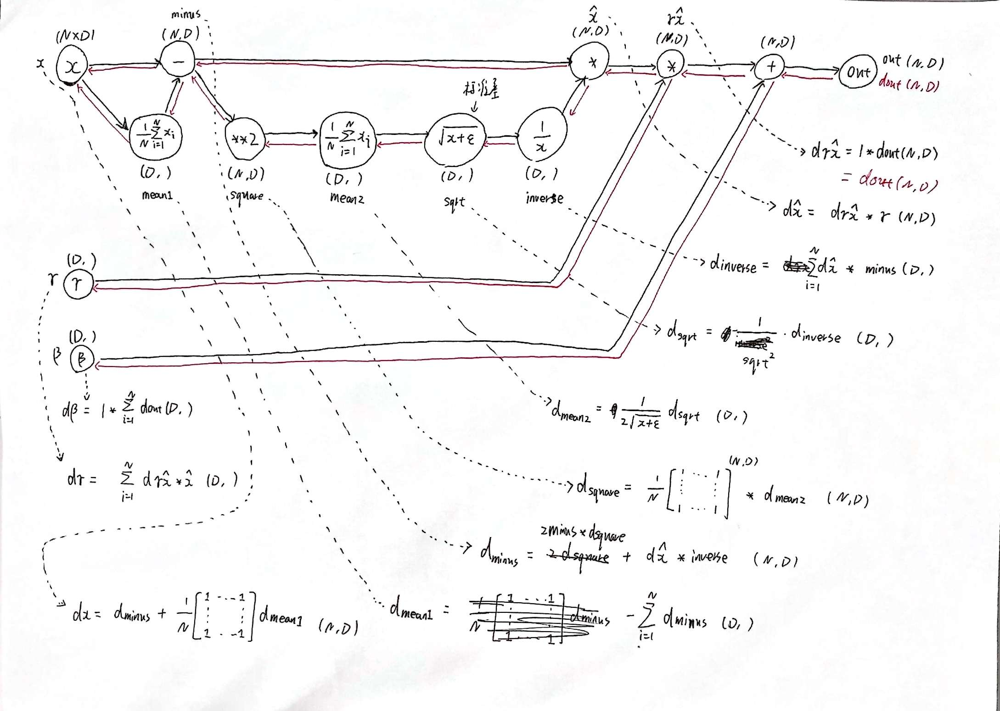

# CS231n 学习总结

断断续续花了大约五周的时间学完了 CS231n，是时候总结一下自己遇到的问题和收获了。
<!--more-->

## 课程信息

课程主页和视频：

- 主页：[CS231n: Convolutional Neural Networks for Visual Recognition](http://cs231n.stanford.edu/index.html)
- 2017 年视频：<https://www.bilibili.com/video/BV1nJ411z7fe>

推荐结合 [Justin Johnson](https://web.eecs.umich.edu/~justincj/) 的 [Deep Learning for Computer Vision](https://web.eecs.umich.edu/~justincj/teaching/eecs498/FA2020/schedule.html) 来学习。CS231n 的讲师Justin Johnson 从斯坦福毕业之后去了密歇根大学任教，教学内容、PPT、实验作业等都和 CS231n 差不多，公开[视频](https://www.bilibili.com/video/BV1Yp4y1q7ms?from=search&seid=10520157556341037278)是 2019 年的。我是按照 2021 年 CS231n 的 [Schedule](http://cs231n.stanford.edu/schedule.html) 来学习的。虽然 CS231n 的课程内容以 lecture 划分，但是经过学习之后，我认为可以分为四大部分：

- Lecture 1-4：主要介绍分类问题、线性分类器、损失函数、优化方法、(全连接)神经网络、反向传播算法，这些属于深度学习基础中的基础，也是**作业1**的主要内容；
- Lecture 5-9：主要介绍卷积神经网络(CNN)、深度学习中的硬件和软件、网络的训练和优化方法、比较著名的网络架构，这部分属于计算机视觉的必备知识，是**作业2**的主要内容；
- Lecture 10-15：主要介绍循环神经网络(RNN)、LSTM、Attention 机制、Transformer 等，还有生成模型、自监督学习、网络可视化和理解、检测和分割，是**作业3**的主要内容；
- Lecture 16-19：这部分是嘉宾 Lecture，没有视频，只有 slides。

另外 [Deep Learning for Computer Vision](https://web.eecs.umich.edu/~justincj/teaching/eecs498/FA2020/schedule.html) 还包括了 3D 视觉、视频分类、强化学习，生成模型部分也比 CS231n 更加详细。下面对各个部分的大致内容和阅读观看过的参考资料和视频做一个梳理，方便用到的时候再回顾。

## Lecture 1-4

Lecture 1 和 2 从图像分类着手，介绍了图像分类问题的难点和流程，并介绍了**最近领**算法，然后要求在作业中实现效果更好的 **KNN** 算法。

> 阅读材料：<https://cs231n.github.io/classification/>

Lecture 3 以 CIFAR10 数据集为例，介绍了线性多分类器、Loss 函数、多分类 **SVM**、**Softmax**，最后对 SVM 和 Softmax 进行了对比。

> 阅读材料：<https://cs231n.github.io/linear-classify/>

接着对求解最优参数的方法进行介绍，包括梯度下降、**gradient check** 技巧、防止数值不稳定(除零或者数值过大)的技巧等。

> 阅读材料：<https://cs231n.github.io/optimization-1/>

Lecture 4 讲解了神经网络、反向传播，手推反向传播很重要的一个工具就是计算图。

> 阅读材料：<https://cs231n.github.io/optimization-2/>

## Lecture 5-9

这部分主要围绕 CNN 展开，Lecture 5 讲解了 CNN 基本知识：**卷积、通道、核、池化**等。

> 阅读材料：<https://cs231n.github.io/convolutional-networks/>

Lecture 6 主要介绍机器学习中的硬件 (**CPU, GPU, TPU**) 和软件 (**TensorFlow, PyTorch, Keras** 等)。

Lecture 7 和 8 主要讲解模型训练中的优化方法，如 **Batch Normalization** 等。这个部分我总结了一个[笔记](https://xietx1995.github.io/2021/optimization)。

Lecture 9 主要介绍主流的网络架构：[AlexNet](https://papers.nips.cc/paper/4824-imagenet-classification-with-deep-convolutional-neural-networks.pdf), [VGGNet](https://arxiv.org/abs/1409.1556), [GoogLeNet](https://arxiv.org/abs/1409.4842), [ResNet](https://arxiv.org/abs/1512.03385)

## Lecture 10-15

Lecture 10 和 11 主要讲解 **RNN、Attention、Transformer**。

> 阅读材料：<https://www.deeplearningbook.org/contents/rnn.html>

另外还有以下资料也很不错：

- [A simple overview of RNN, LSTM and Attention Mechanism](https://medium.com/swlh/a-simple-overview-of-rnn-lstm-and-attention-mechanism-9e844763d07b)
- [Illustrated Guide to LSTM’s and GRU’s: A step by step explanation](https://towardsdatascience.com/illustrated-guide-to-lstms-and-gru-s-a-step-by-step-explanation-44e9eb85bf21)
- Attention原始论文：<https://arxiv.org/abs/1409.0473>
- Self-Attention原始论文：<https://arxiv.org/abs/1601.06733>
- [Attention? Attention! (lilianweng.github.io)](https://lilianweng.github.io/lil-log/2018/06/24/attention-attention.html)
- Attention视频讲解：<https://youtu.be/XhWdv7ghmQQ>
- Selft-Attention视频讲解：<https://youtu.be/Vr4UNt7X6Gw>
- Transformer原始论文：<https://arxiv.org/abs/1706.03762>
- Transformer视频讲解：<https://youtu.be/aButdUV0dxI>
- [The Illustrated Transformer – Jay Alammar](http://jalammar.github.io/illustrated-transformer/)
- [Transformers from scratch](http://peterbloem.nl/blog/transformers)

Lecture 12 和 13 分别是**生成模型、自监督学习**，李宏毅的视频讲得很好：

- 生成式对抗网络：<https://youtu.be/4OWp0wDu6Xw>
- 自监督学习：<https://youtu.be/e422eloJ0W4>

其他不错的资料：

- [A Gentle Introduction to Generative Adversarial Networks (GANs)](https://machinelearningmastery.com/what-are-generative-adversarial-networks-gans/)
- [Self-Supervised Representation Learning (Lilian Weng Blog Post)](https://lilianweng.github.io/lil-log/2019/11/10/self-supervised-learning.html)

Lecture 14 主要讲特征可视化，如 **Saliency Maps** 等，Lecture 15 主要讲**目标检测、语义分割**等。

## Lecture 16-19

这部分是嘉宾 Lecture，无视频，部分无 Slides。

## 作业难点

CS231n 的作业比较硬核，大部分必须手写梯度计算和反向传播，其中还有很多技巧和细节。通过这种折磨之后，结合阅读框架部分源码，自己也大概了解了框架内部具体是怎么做的。下面总结一下作业中的难点。

### Assignment 1

个人认为作业1中比较难的有三个，主要是需要手动计算梯度：

- Q2: Training a Support Vector Machine
- Q3: Implement a Softmax classifier
- Q4: Two-Layer Neural Network

Q2 和 Q3 需要推导梯度计算公式，向量化版本需要思考。关于 Softmax 的梯度计算，我总结了一篇[文章](https://xietx1995.github.io/2021/softmax)

全连接的反向传播就是矩阵求导，和上游梯度相乘即可。

### Assignment 2

作业 2 中比较难的是 Batch Normalization 和 CNN 的反向传播：

- Q2: Batch Normalization
- Q4: Convolutional Neural Networks

以 Batch Normalization 为例，只要推出的梯度计算公式，写代码就清晰明了：

CNN 的反向传播需要一点想象力。推荐阅读文章：[Convolutions and Backpropagations](https://medium.com/@pavisj/convolutions-and-backpropagations-46026a8f5d2c)

### Assignment 3

作业 3 中比较难的是 RNN 和 Transformer 的梯度计算：

- Q1: Image Captioning with Vanilla RNNs
- Q2: Image Captioning with Transformers

RNN 中比较难的是梯度在时间步之间的积累，Transformer 中比较难的是理解 Q、K、V 矩阵的反向传播。

总之，利用计算图，就可以很方便地推导出梯度计算公式，写出代码就比较顺理成章了，但是如果要写出向量化的代码还是比较难的，这需要对 numpy、矩阵计算有更进一步的掌握才行。

---

总之，CS231n 还只是起步，想要研究各个细分的方向需要更进一步的学习才能进步。

